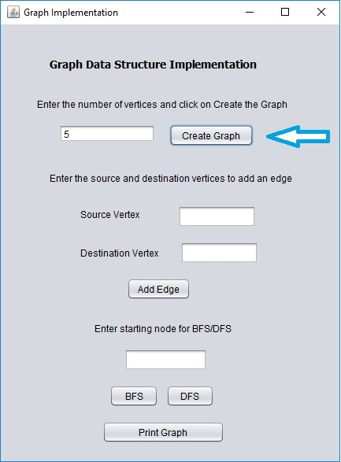
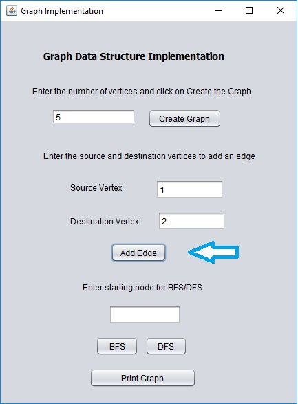
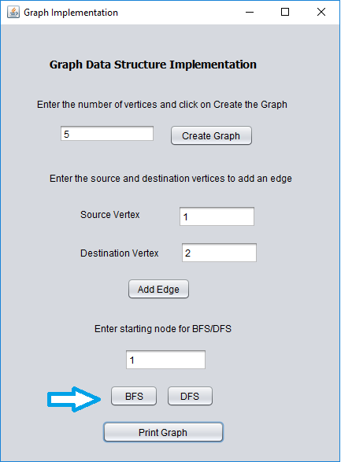
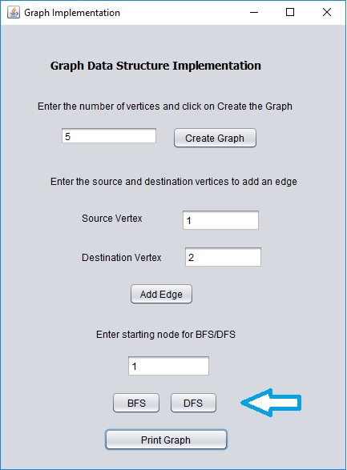
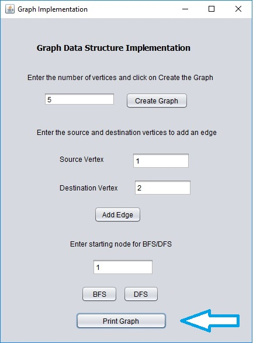

# Graph Implementation with BFS and DFS

Implementation of directed and undirected graphs with following functionalities  
	* Adding a new vertex  
	* Adding a new edge  
	* Displaying a vertex  
	* Deleting a vertex  
	* Deleting an edge  
	* Breadth First Search (BFS)  
	* Depth First Search (DFS) 

## Running the program

Download the [Graph_Implementation.jar](Graph_Implementation.jar) file and double click to open it. Then it will open like this.

### Creating the graph 
Enter the number of vertices and click on Create Graph button

### Adding an edge 
Enter the source and destination vertices and click on Add Edge button button

### Performing BFS 

### Performing DFS 
	
	

### Printing the graph 
	
	
	
## License

This project is licensed under the MIT License - see the [LICENSE.md](LICENSE) file for details
