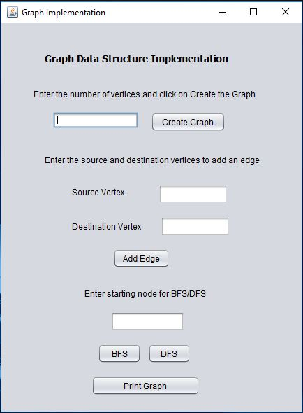

# Graph Implementation with BFS and DFS

Implementation of directed and undirected graphs with following functionalities  
	* Adding a new vertex  
	* Adding a new edge  
	* Displaying a vertex  
	* Deleting a vertex  
	* Deleting an edge  
	* Breadth First Search (BFS)  
	* Depth First Search (DFS) 

## Running the program

	
## License

This project is licensed under the MIT License - see the [LICENSE.md](LICENSE) file for details
